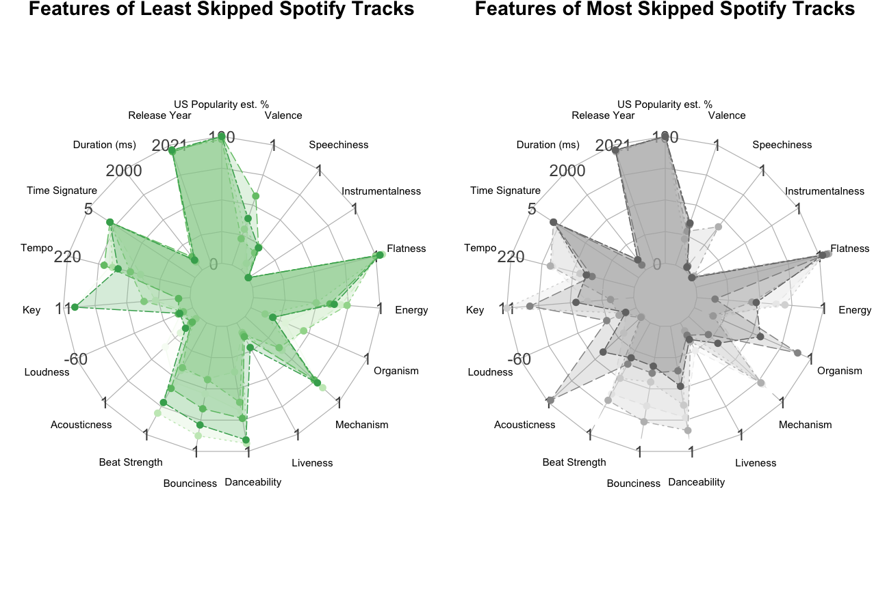

# Spotify Selling Out

Analyzing visually how _*theoretically*_ a musician might make a data driven plan to make popular music. (Please don't use this to make music!)

View the R Markdown Notebook (.Rmd) or its more pleasing .html version in your browser.

Work in progress, with this exploratory data analysis leading to an interactive data product which would be presented to convey findings to the musician.

Developed as an assignment in MICA Data Analytics & Visualization MPS program course titled _Visual Storytelling_ with professor Justin Elszasz.
Feel free to submit comments or contribute with improvements to code if you are inclined with the time to do so. Thanks for looking!
